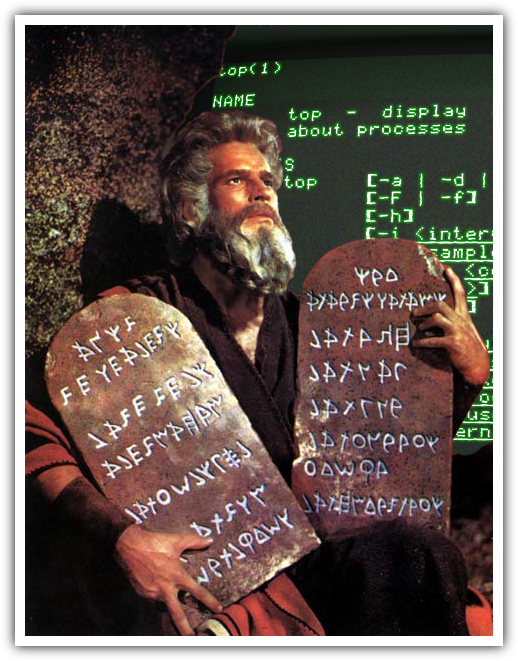

Moses [](http://travis-ci.org/daytonn/moses) [](https://codeclimate.com/github/daytonn/moses)
=====
Moses is a simple option/command parser for building command line applications in Ruby.


Getting Started
---------------

Installation with ruby-gems:

    gem install moses

Installation with bundler:

    gem 'moses', '0.1.5'

Creating a Moses application
----------------------------

Moses is a module that you can include into any Ruby class to provide all the plumbing you need to write command line applications. Create the following directory structure for your application

- bin
  - myapp
- lib
  - myapp.rb
- VERSION
- HELP.md (or just HELP)

Create a class for your applications functionality:

```rb
  class MyApp
    include Moses
    commands :foo, :bar

    def foo
      # do stuff
    end

    def bar
      # do stuff
    end
  end
```

Then all you need in your executable file is the following:

```rb
  #!/usr/bin/env ruby
  $: << File.expand_path(File.join(File.dirname(__FILE__), "../lib"))
  require 'myapp'
  MyApp.new.run
```

That's all you need to create a CLI app. You can now call your application like so:

    myapp foo
    myapp bar

By default, Moses will read the contents of the HELP.md (or HELP) file in the root of your project. This will be used to display your application instructions when passed the flags `-h` and `--help`

    myapp -h
    myapp --help

 Similarly, Moses will use the VERSION file with the `-v` and `--version` flags.

     myapp -v
     myapp --version

You may choose not to use `VERSION` or `HELP` files in your project and simply define corresponding methods that output what you want:

```rb
def help
  output.puts "This is my help text"
end

def version
  output.puts "X.X.X"
end
```

Commands
--------

Moses treats the first non-flag argument passed to it as a command (sometimes referred to as sub-commands). A command is simply a method defined in your application class. To define a command, simply add a command definition to your class and implement a method of the same name:

```rb
  class MyApp
    include Moses
    commands :foo

    def foo
      # do stuff
    end
  end
```

This will create a `foo` command that can be called from the command line: `myapp foo`

### Default command

Sometimes you will want to create an application that has no "sub-commands" and will simply be called from the command line with options. To run a command by default, add a default_command definition to your class:

```rb
  class MyApp
    include Moses
    default_command :main

    def main
      # do stuff
    end
  end
```

In the above example, the `main` method will execute whenever your application is run. Simply calling `myapp` from the command line will execute the `main` method.


Options
-------

Moses will parse any flags passed to your application that begin with one or two dashes. There are two basic types of flags, boolean and variable flags.

### Boolean flags

Flags which begin with one dash are treated as boolean flags. A boolean flag is basically an _ON_ switch:

    myapp -x

The above will create an `:x` key in the `@options` hash that is true. Given the above switch, we could write code to handle that switch like so:

```rb
  if @options[:x]
    # stuff here
  end
```

### Variable flags

Flags which begin with two dashes are slightly trickier than boolean flags. Variable flags can be either boolean or be passed a value. Variable flags will be treated as a boolean if no arguments are passed after them:

    myapp --foo

In the above example the value of `@options[:foo]` will be true. However if an argument is passed after the flag, it will automatically be assigned as the value:

    myapp --foo bar

In this case the value of `@options[:foo]` will be the string `bar`. The flag can still be treated as a boolean but it's adjacent argument can also be accessed as it's value:

```rb
  if @options[:foo]
    x = @options[:foo] # bar
  end
```

### Option commands

It's common to run a command as the result of an option being passed (ie. `-h` or `--help`). To run a command automatically when an option is passed, simply add an `option_commands` definition to your class:

```rb
class MyApp
  include Moses
  option_commands({ :auto => :run_automatic })

  def run_automatic
    # automatically runs when --auto is passed
  end
end
```

_Note: When using `option_commands`, no other command will be run. If you wish to execute multiple commands based on an option, simply use the boolean flag._

Output
------

By default Moses exposes `$stdout` through an `output` method. To output to the terminal, simply use `output.puts`:

```rb
  output.puts "This will be output to STDOUT"
```

To substitute your own output, define an initializer that overwrites the `@output` variable:

```rb
class MyApp
  def initialize(output)
    @output = output
  end
end

MyApp.new(File.open('output.txt'))
```
